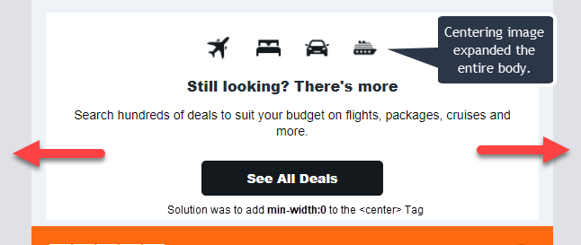
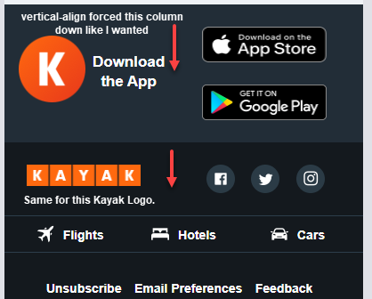

# Kayak Email Mockup Project
This will be a fully responsive mockup of a Kayak.com marketing email. 

## Technologies used
[Zurb's Foundations for Email Framework](https://get.foundation/emails/docs/panini.html), which includes:

* Panini templating engine
* HTML
* SCSS
* JavaScript

## Preview of Project
This is the intended result.


## Current Results


## Original project idea
Codingphase.com's [HTML Email Frameworks](https://codingphase.teachable.com/p/html-email-frameworks)

## Colors Used
```
background: #f1f4f7
light orange: #ff6a10;
dark orange : #d65600
light-grey: #EFF2F6
greyish blue: #222d37;
dark color: #14191e;
```

## Important Quirks
A few issues occured along the way which I want to highlight here. 
### Columns stacking on top of each other in **Firefox**
Despite the columns aligning correctly in Chrome, Firefox was not displaying the columns in the correct order. For example, if I wanted 2 columns next to each other, Chrome would display it correctly, but Firefox did not. THe solution found was to add the following code under the container **row**.
```css
 white-space: nowrap;
```
The other way around this is to not stack your code. Make the closing and opening column tags sit right next to each other. I don't like the way it looks in VSCode, so I kept the first solution.
```html
<column>
....
</column><column>
...
</column>
Next bits of code....
```
### Padding issues within nested rows/columns
Foundations framework has built in settings in the _settings.scss_ file. One that kept throwing me off was the padding-bottom global setting. I ended up setting that to 0 so I could customize each column's padding as I'd like. This is under the "Grid" section.
If setting the padding of column (assigned to a class) doesn't work, then select the `<th>` element and add padding there instead.

### Centering content
Though centering content works by using a `<center>` or using class of `text-align-X(left,center, or right)`, I had to center the content of the subheader by targeting the `<th>` element. 

First target the .columns (`<columns>` in the HTML), then nest the `th` selector within and center your content there
```css
.sub-header{
 /* selectors.... */
  .columns{
    padding-top: 5px;
    padding-bottom: 5px!important;
    padding-left: 10px!important;
    padding-right: 10px!important;
 /* selectors.... */
    th{
      text-align: center;
    }
  }
}
```
### The Center Tag expanding issues

The image with the 4 grouped icons kept expanding the email container (width should not exceed 596px). All the `!important` added to the values didn't help. 
**Solution**
Targetting the `<center>` and removing the min-width placed by the built in grid css solved this problem.
```css
 &.last-offer{
          center{
            min-width: 0;
          }
          .grouped-icons{
            width: 190px;
          }
```
### Vertical aligning nested elements
This one took me a while! Only by examining the the Developer tools in Chrome or Firefox could I see how to narrow down the specific nested elements I needed to vertically align the pictures. This only affected the mobile view.
The solution was to target the child and descendent children up to to the `th` element which contained the content needing to be vertically align down the middle.


```css
.sub-footer{
    ...
    background-color: $kayak-semidark;
    table, tr, td, th{
      vertical-align: middle;
    }
```
### Being specific with classes
To not fight so much with this framework, I believe I should add more class names to the rows and tables.
I noticed toward the end of the designing, that I had less problems when  used more class names instead of  I think that helped with specifying things like padding, the `center` tag not adding a min-width that enlarged the entire body, margins, etc. 

---
## Creating Data
The benefit of using this framework is not having to have static information within the HTML. Instead, we can utilize a JSON file and just like other web framework, this data can be dynamically placed into the page. In this case, it will be compiled into the email body. 
Why is this valuable? Because to update the email, as long as no style changes need to be made, we just update the JSON file, just like if it were a database object.

### The JSON file
Please see the [json](src/data/kayakEmail.json) file of this project for details. 
**Don't Forget** to add the data file location to the `gulpfile.babel.js` file
```
function pages() {
  return gulp.src(['src/pages/**/*.html', '!src/pages/archive/**/*.html'])
    .pipe(panini({
      root: 'src/pages',
      layouts: 'src/layouts',
      partials: 'src/partials',
      helpers: 'src/helpers',
      data:'src/data'   <------------ THIS 
    }))
    .pipe(inky())
    .pipe(gulp.dest('dist'));
}
```
### Accessing array items 
To access items from an array, you have to add a `.` between the array item's index number. Normally I wouldn't have to do this.
```html

```

---
### Copyright Notice
No copyright infringment is intended. I don't own any of the assets within. This is for educational purposes only.